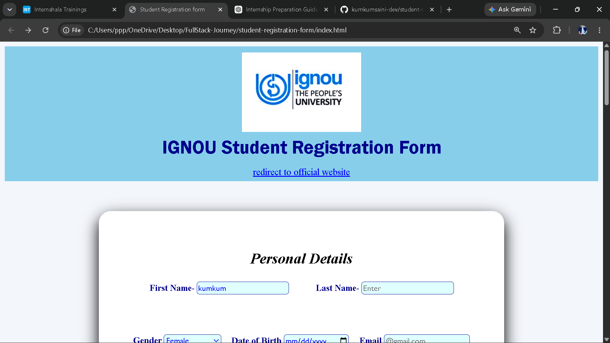
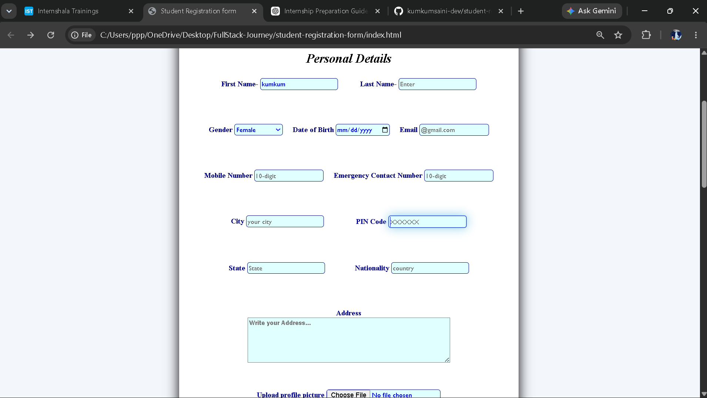
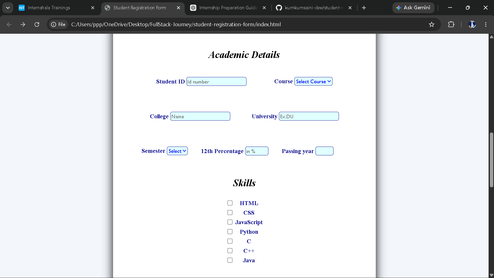
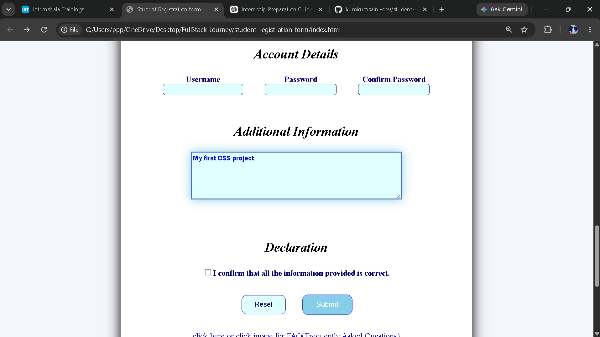
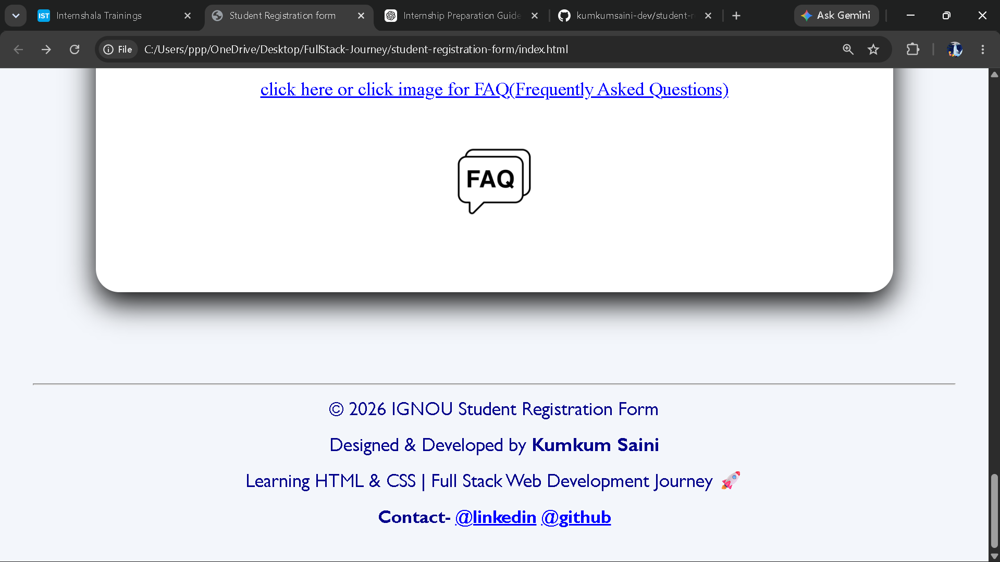

# 🎓 IGNOU Student Registration Form

A responsive student registration form built using **HTML5** and **CSS3** as part of my Full Stack Web Development learning journey.

This project helped me strengthen my understanding of HTML forms, CSS styling, layout design, and responsive web design.

---

## 📸 Project Screenshots

### 1. Home Page


### 2. Personal Details Section


### 3. Academic Details and Skills Section


### 4. Account Details and declaration


### 5. Footer


---

## ✨ Features

- Clean and modern user interface
- Student registration form
- Organized sections for easy navigation
- Responsive design using Media Queries
- Custom styled input fields
- Hover effects on buttons
- Focus effects on form elements
- Profile picture upload
- Course and semester selection
- Skills selection using checkboxes
- Declaration section
- Footer with developer information

---

## 🛠️ Technologies Used

- HTML5
- CSS3

---

## 📂 Project Structure

```
student-registration-form/
│
├── index.html
├── style.css
├── images/
├── screenshots/
└── README.md
```

---

## 📚 What I Learned

While building this project, I practiced:

- Creating HTML forms
- Using semantic HTML
- CSS selectors
- Box Model
- Padding & Margin
- Border Radius
- Box Shadow
- Hover Effects
- Focus States
- Responsive Design with Media Queries
- Project organization
- GitHub repository management

---

## 🎯 Future Improvements

- Form validation using JavaScript
- Better responsiveness
- Improved UI/UX
- Backend integration for storing form data

---

## 👩‍💻 Developed By

**Kumkum Saini**

BCA Student | Aspiring Software Engineer

Currently learning **Full Stack Web Development** and building projects to strengthen my development skills.

---

⭐ If you like this project, feel free to give it a star!
